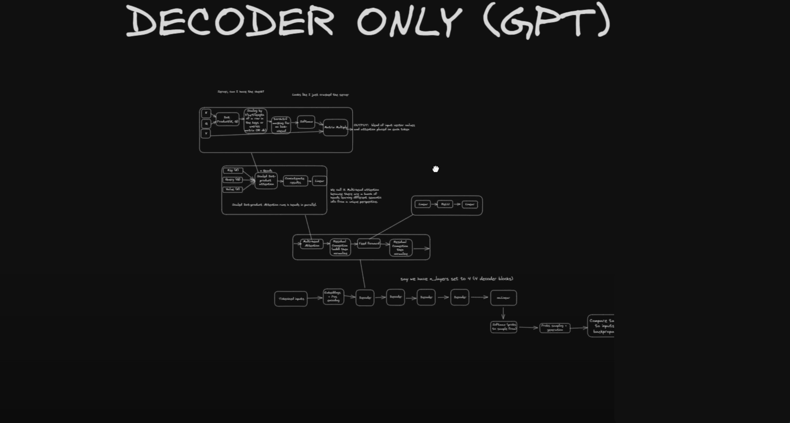

# Explanation

Using the Bigram language Model, i attempted to construct and understand the underlying structure of LLM's.

At the beginning of this tutorial, I was unaware of what the Bigram language model was doing and how it interacted with the GPTP architecture, and thought that this approach could produce a GPT level AI.
However the further I progressed, the clearer it became that this was not a possibility. 

This path helped me understand what N-Gram models were doing, the architecture of transformers and the attention matrix that worked behind it.

The text used for the final executions came from OpenWebText: OpenWebText Download - https://skylion007.github.io/OpenWebTextCorpus/

To run this script and test the model with the wizard_of_oz.txt file (using the gpt-1.ipynb file):
1. Download the 'wizard_of_oz.txt' from the directory
2. Comment out the text reffering to the openwebtext/vocab.txt 
3. Uncomment theh text reffering to the wizard of oz text ( this is marked out clearly in the file)

To run this script and test the model using the openwebtext files using the chatbox file:
1. make sure you have up to  90gb of memory free.
2. Download the openwebtext data from the link above (it is 12gb of data ) and place it in the same folder as the data_extraction.py file
3. Run the data_extraction and place the output files into the openwebtext folder
4. Run the chat_box.py file with the pre-made 'BigramLM-GPT-model-01.pkl'file and see results.

# EDIT: I COULD NOT UPLOAD PKL FILE. YOU WILL HAVE TO CREATE YOUR OWN. SEE STEPS BELLOW! 

To run the script and create your own model with personal parameters:
1. Repeat steps 1-3 from above
2. Run the training.py file, adjusting params to your personal preference.
3. Rename the model 

To retrain the model, under the GPTLanguageModel, uncomment the code and replace the file name with your own model name and retrain.

Training the model can also be done using the 'gpt-1.ipynb' file however this would not be done using your terminal. 

# Internal Architecture of a Transformer including MHA, SA, encoding and decoding.

# Decoder only

